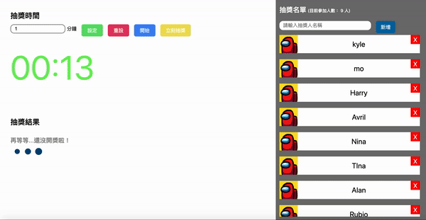

# Live Countdown Picker
A simple lottery webapp built with Next.js, TypeScript, Redux Toolkit and Styled-Components.



## Preview
[Live Countdown Picker](https://live-countdown-picker.vercel.app/)

## Installation

```shell
$ git clone https://github.com/kylemocode/live-countdown-picker.git
$ cd live-countdown-picker
$ npm install && npm run dev (or using yarn instead)
```

## Features:

### High Performance And Good SEO

In addition to some performance optimizations unique to react such as useMemo, useCallback...etc, this project also implement virtualized list in CandidatesList component, preventing performance bottleneck while the candidates list is huge.

Provide basic meta tag to get a good SEO point in lighthouse.

### Maintainable And Scalable Code Base
Although this is a small project, I still presuppose that it will need to scale in the future, so I manage the code base as maintainable and scalable as I can. For example, I utilize theme provider in styled-components (now only support media query, maybe it can support font color and some design guideline in the future)

### Use RTK To Avoid Complex Redux Boilerplate
This project use [Redux-Toolkit](https://github.com/reduxjs/redux-toolkit) to structure redux data architecture, making the code base more readable and maintainable.

### Responsive Web Design (RWD)
Currently, the project only support Desktop version and Tablet version (768px as break point), but I will easily expand the styles of different device sizes in the future.

### Polyfill-less Bundling Script
Inspired by [this post](https://instagram-engineering.com/making-instagram-com-faster-code-size-and-execution-optimizations-part-4-57668be796a8), this project uses ES2017 as Typescript transpile target, since nearly 56% of user's browser supports ES2017+ syntax. As a result, this shrinks source-mapped bundle size, and gained runtime performance.

## Roadmap (Todo List)
  - [ ] Turn this project to Full-Stack project using Next.js API routes, which will turn your API endpoint to serverless lambda function
  - [ ] Batch insert candidates
  - [ ] Candidates can upload his/her own avatar
  - [ ] More styles for different device sizes (Now only use 768px as the break point)
  - [ ] Flexible timer (Currently support minute only)
  - [ ] Persistence feature such as redux-persist or DB storage.
  - [ ] Increase Unit Test Coverage
  - [ ] CICD Pipeline
